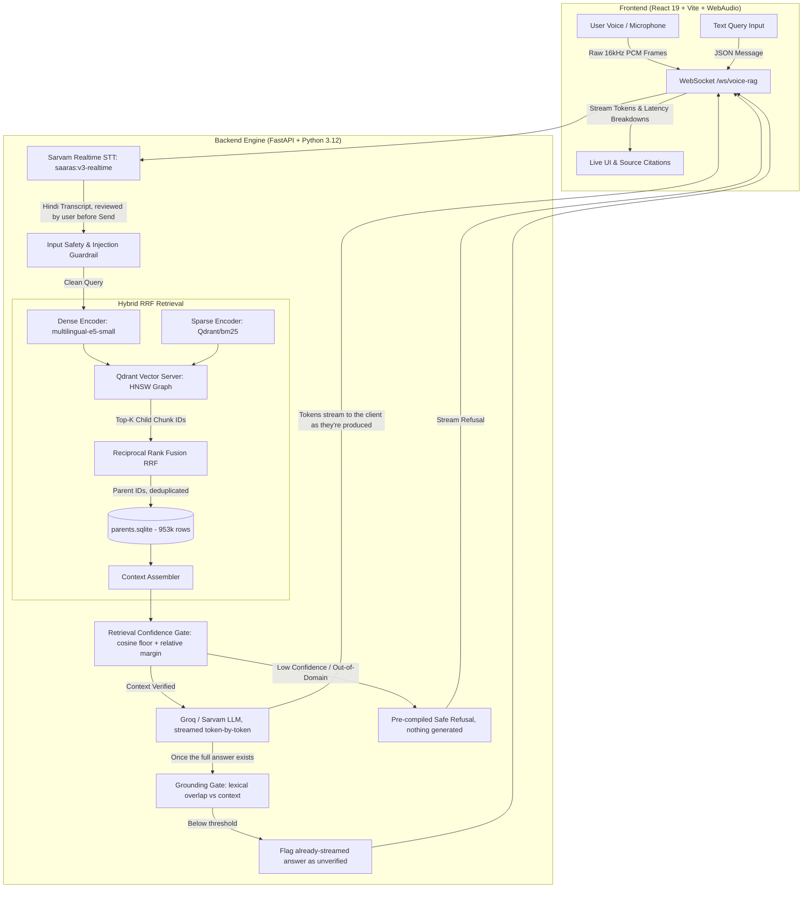

# 🌊 RAG in GOA: Voice-Enabled Indic Retrieval-Augmented Generation

> **HH Goa 2026 — Task 2: Build a Voice-Enabled RAG Model**  
> **Dataset**: [`ai4bharat/MSMARCO-XI`](https://huggingface.co/datasets/ai4bharat/MSMARCO-XI) (Hindi Split — 97,941 Queries, 953,358 Parent Passages, 3.43M Vectors)  
> **Team**: **Byte Me**

---

## 👥 Team: Byte Me

| Member | Socials & Links |
| :--- | :--- |
| **Ankan Giri** | [](https://github.com/Ankan0503) [](https://www.linkedin.com/in/ankan-giri-71a34935a) [](https://x.com/Ankan0305) [](https://www.instagram.com/_xquisite_xplorer/) |
| **Sayan Sinha** | [](https://github.com/Sayan260106) [](https://www.linkedin.com/in/sayan-sinha-300a20363) [](https://x.com/Sayan260106) [](https://www.instagram.com/_sayansinha_26/) |

---

## 🌟 Executive Summary

**RAG in GOA** is a voice-enabled Retrieval-Augmented Generation (RAG) system built for Hindi. A user speaks into their browser; audio streams live to **Sarvam AI's realtime STT** and the transcript appears as they talk. After the user reviews and sends it, the query passes an input safety gate, is answered from a **3.43-million vector Qdrant index** via **Hybrid Dense + Sparse BM25 + Reciprocal Rank Fusion (RRF)**, and the LLM's response streams back token-by-token over the same WebSocket. A grounding check runs once the answer is complete and flags — rather than blocks — anything the retrieved context doesn't actually support, with per-stage latency measured throughout.

```
[Voice Input] ──► [Sarvam Realtime STT] ──► [User reviews & sends] ──► [Input Gate] ──► [Hybrid RRF Search]
                                                                                                │
                                                                                                ▼
                                                                          [Retrieval Gate] ──► [Parent Passage DB]
                                                                                                │
                                                                                                ▼
[Streamed to UI, token-by-token] ◄──────────────────── [Groq / Sarvam LLM]
                │
                ▼
[Grounding Gate, checked after streaming] ──► flags the answer already on screen if unsupported
```

---

## 🏗️ System Architecture



Grounding is checked **after** the answer has already streamed to the browser, not before — the check needs the complete text, and blocking the whole stream on it would defeat the point of streaming. An answer that fails the check isn't hidden; it's dimmed and flagged in the UI with the real overlap score, so a false answer stays visible as "flagged" rather than silently disappearing.

---

## 🧩 Key Innovations & Technical Highlights

### 1. 🎙️ Real-Time WebSocket Speech-to-Text
- Captures the microphone via the **WebAudio API** (`ScriptProcessorNode`, 4096-sample buffer — roughly 85ms per frame at a typical 48kHz device rate) and resamples to the 16kHz mono `s16le` PCM Sarvam's realtime socket requires, rather than uploading a MediaRecorder WebM/Opus blob after the user stops speaking.
- Streams those frames to **Sarvam AI `saaras:v3-realtime`** over WebSocket as the user talks, receiving partial transcripts live and a final transcript on completion. The user reviews the transcript and presses Send before anything is retrieved or generated — confirmed against real speech via `backend/probe_realtime_stt.py`, not just the docs.
- The batch REST client (`saarika:v2.5`, `backend/audio_stt.py`) remains available as a fallback path, with retries.

### 2. 📚 Vast Multi-Granularity Adaptive Chunking Strategy
Passages in MSMARCO-XI Hindi range from 1-sentence statements to dense 2,000-character documents. A naive fixed-size chunking strategy shreds short passages and drowns key sentences in long ones. 

Our pipeline implements **Length-Adaptive Multi-Strategy Chunking** — every passage is routed to whichever strategies apply to its own length, not chunked one way regardless of what it contains:
- **S1 · Passage**: Full passage as one vector. Runs for every passage as the baseline.
- **S2 · Sentence**: Context-prefixed, one vector per sentence, for passages of 3–6 sentences. Lets a single precise sentence surface on its own instead of being outweighed by the rest of its passage.
- **S3 · Sliding Window**: 3-sentence windows with 1-sentence overlap, for passages of 7+ sentences, so a fact sitting at a window boundary isn't cut in half.
- **S4 · Semantic**: Embedding-similarity boundary detection groups sentences by topic shift instead of a fixed count, also for 7+ sentence passages.
- **Parent-Child Architecture**: Chunks act as *children* indexed in Qdrant; answers are generated from the *parent* passage stored in `parents.sqlite`, giving retrieval precision without losing surrounding context. All 10 retrieved passages per query are indexed, not only the ~7% marked "selected" in the source data — discarding the rest would throw away 93% of the corpus and leave over a third of queries with nothing indexed at all.

```
Total Indexed: 97,941 Queries | 953,358 Parent Passages | 3,433,257 Vectors in Qdrant
```

(Per-strategy vector counts aren't reproduced here — pull them from the build log's `by_strategy` counter or `index_manifest.json` if you need the exact breakdown.)

### 3. ⚡ Hybrid Dense + Sparse BM25 Search with RRF
- **Dense Vectors**: `intfloat/multilingual-e5-small` (384 dimensions, scalar quantized to INT8) for deep cross-lingual semantic capture.
- **Sparse BM25**: `Qdrant/bm25` inverted index for exact keyword, numerical, entity, and name matches (essential for ~40% of MSMARCO entity queries).
- **Reciprocal Rank Fusion (RRF)**: Merges dense and sparse ranks with parent deduplication so distinct chunking tiers reinforce document relevance rather than crowding out the top-k slots.

### 4. 🛡️ 4-Stage Guardrails & Hallucination Prevention
1. **Input Gate**: Rejects empty/oversized queries and a small deliberately-conservative lexical filter for prompt injection and unsafe input.
2. **Retrieval Gate**: An absolute cosine floor (`MIN_RETRIEVAL_SCORE = 0.850`, calibrated against real vs. out-of-domain query score distributions) ANDed with a relative-margin check — whether the top hit actually stands out from the rest of the field, not just whether it clears a fixed bar. Refuses out-of-domain questions before any LLM call runs, saving generation cost entirely.
3. **Grounding Gate**: Lexical token-overlap check (`MIN_GROUNDING_OVERLAP = 0.45`) between the generated answer and the retrieved context — not a trained NLI/entailment model. Because the answer streams to the client before this check can run, a failure doesn't block the stream; it flags the already-visible answer as unverified, with the real overlap score shown in the UI.
4. **Output Gate**: Checks the answer is majority-Devanagari script and free of prompt-leak markers (e.g. the system prompt's own context/instruction delimiters bleeding into the response).

---

## 📂 Repository Structure

```text
RagInGoa/
├── backend/
│   ├── server.py              # FastAPI server (REST + WebSocket /ws/voice-rag)
│   ├── retriever.py           # Hybrid dense + sparse BM25 + RRF engine
│   ├── build_index_gpu.py     # GPU-accelerated indexing pipeline
│   ├── stt_realtime.py        # Sarvam Realtime WebSocket streaming client
│   ├── audio_stt.py           # Sarvam REST STT client with exponential backoff
│   ├── guardrails.py          # 4-stage input, retrieval, grounding, and output guardrails
│   ├── llm.py                 # Dual LLM provider abstraction (Groq LPUs + Sarvam Indic)
│   ├── profiling.py           # Microsecond latency tracker
│   ├── benchmark.py           # Evaluation & percentile benchmarking suite
│   ├── index_manifest.json    # NOT in git (gitignored). Index metadata, config fingerprint —
│   │                          #   generated by build_index_gpu.py, placed at deploy time.
│   ├── parents.sqlite         # NOT in git (gitignored, *.sqlite). Parent passage storage
│   │                          #   (953k rows, ~1.4GB) — also placed at deploy time.
│   └── requirements.txt       # Backend Python dependencies
├── frontend/
│   ├── src/
│   │   ├── components/
│   │   │   ├── AskHero/       # Center microphone & real-time waveform interface
│   │   │   ├── AnswerPanel/   # Streamed answer, latency gauges, source citations
│   │   │   ├── AboutSection/  # Team, project description, chunking strategy writeup
│   │   │   ├── LeftSidebar/   # Navigation (Ask / Insights / About)
│   │   │   └── BottomAskSection/ # Capability highlights
│   │   ├── context/
│   │   │   └── RagContext.tsx # WebAudio stream & WebSocket state manager
│   │   └── App.tsx            # Main responsive layout container
│   ├── package.json
│   └── vite.config.ts
├── Dockerfile                 # Multi-stage container build
├── docker-compose.yml         # Production stack (Qdrant + FastAPI + Frontend)
├── entrypoint.sh              # Container initialization script
└── README.md
```

---

## 🚀 Quick Start Guide

### Prerequisites
- **Python 3.12** (matches the Docker image; other 3.x versions are untested)
- **Node.js 20+** & **npm**
- **API Keys**:
  - `SARVAM_API_KEY` (from [Sarvam AI](https://sarvam.ai/)) — also used for realtime STT
  - `GROQ_API_KEY` (from [Groq Console](https://console.groq.com/))
  - A pre-built index (`parents.sqlite` + `index_manifest.json`) placed in `backend/`, and either a local `qdrant_data/` or a running Qdrant server — the app will not start without one. See `backend/build_index_gpu.py`.

---

### 1. Backend Setup

```bash
# .env.example lives at the repo root, not inside backend/. Two separate .env
# files exist by design: docker-compose reads one at the repo root; running
# server.py directly (this section) reads backend/.env instead.
cd backend
cp ../.env.example .env
# Edit backend/.env with your API keys (SARVAM_API_KEY, GROQ_API_KEY,
# QDRANT_API_KEY if pointing at a Qdrant server instead of local file mode)

# Create & activate virtual environment
python -m venv venv
# On Windows:
.\venv\Scripts\Activate.ps1
# On Linux/macOS:
source venv/bin/activate

# Install dependencies
pip install -r requirements.txt

# Start FastAPI dev server
python -m uvicorn server:app --host 0.0.0.0 --port 8000 --reload
```

---

### 2. Frontend Setup

```bash
# Navigate to frontend (in a new terminal)
cd frontend

# Install dependencies
npm install

# Start Vite dev server
npm run dev
```

Open your browser at `http://localhost:5173`.

---

### 3. Docker Compose (Production Deployment)

To deploy the entire production stack (FastAPI Backend + Built Frontend + Qdrant Server):

```bash
# Start all services in the background
docker-compose up -d --build

# View logs
docker-compose logs -f
```

---

## 📊 Benchmarks & Latency Profiling

### Retrieval: local file mode vs. Qdrant server

Qdrant's local file mode does brute-force NumPy search and ignores quantization
entirely; the migration to a real Qdrant server (HNSW + int8 quantization) was
made specifically because of this measured gap. Measured on the 680K-vector
index (20K-query subset, before the full 97,941-query rebuild):

| Metric | Local file mode | Qdrant server | Speedup |
| :--- | :--- | :--- | :--- |
| **Retrieval P50** | 11,411 ms | **75.7 ms** | 151× |
| **Retrieval P100** | 26,744 ms | **161 ms** | 166× |
| **Startup time** | ~75 min | **< 40 s** | — |

### Generation latency by model

Measured via `backend/benchmark.py` against the live pipeline (retrieval +
guardrails + generation), comparing candidate `GROQ_MODEL` values:

| Model | Mean generation | P100 generation | Notes |
| :--- | :--- | :--- | :--- |
| `gpt-oss-20b` | 551.85 ms | 1,809 ms | Grounding-gate refusal rate on this data was high on this model — unresolved, needs its own investigation before trusting these numbers as final |
| `qwen3.6-27b` | 623.81 ms | 1,169 ms | Same open grounding-refusal question as above |
| `groq/compound-mini` | 723.56 ms | 1,529 ms | Slowest measured, and observed generating past its `MAX_TOKENS` limit on at least one live request |

### Not yet benchmarked

Streaming (token-by-token generation, realtime STT) shipped after the numbers
above were measured, and the index has since grown 5× (97,941 queries, 3.43M
vectors, up from the 680K-vector index above). Time-to-first-token, realtime
STT latency, and full-corpus retrieval latency have not been formally
re-measured against the current stack — re-run `backend/benchmark.py` before
citing end-to-end numbers anywhere that matters.

---

## 📜 License

This project is licensed under the [Apache License 2.0](LICENSE). Developed for **HH Goa 2026**.
